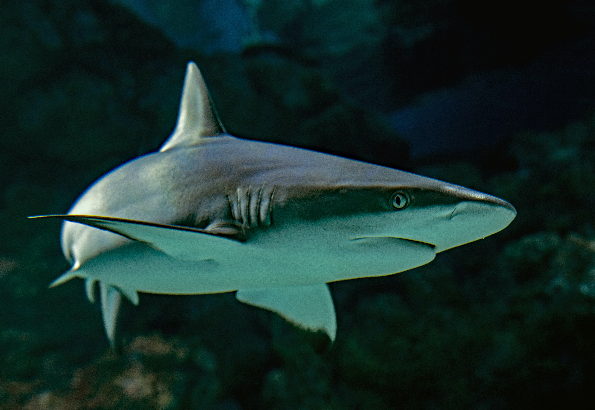

# Data Cleaning in Pandas
## W2 Project

### Andrés Castro

For this project I will analyze data from reported shark attacks arround the world for more than 200 years. The data was recovered in a CSV file from kaggle.com and cleaned using pandas in python. For the analysis I used Seaborn and Matplot Lib.

The cleaning of the data went through each column and applied several process to get to a file that had the most complete, accurate data possible. However, many things couldve done better.