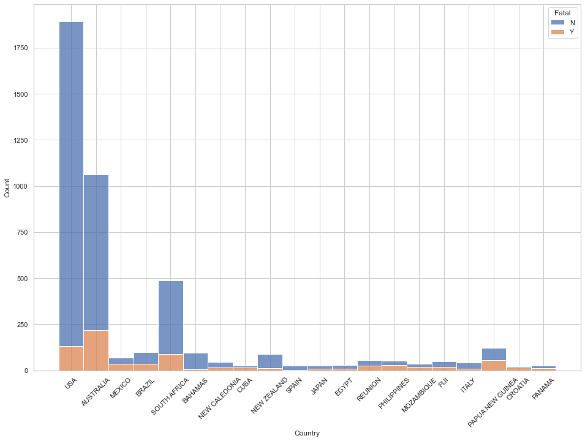
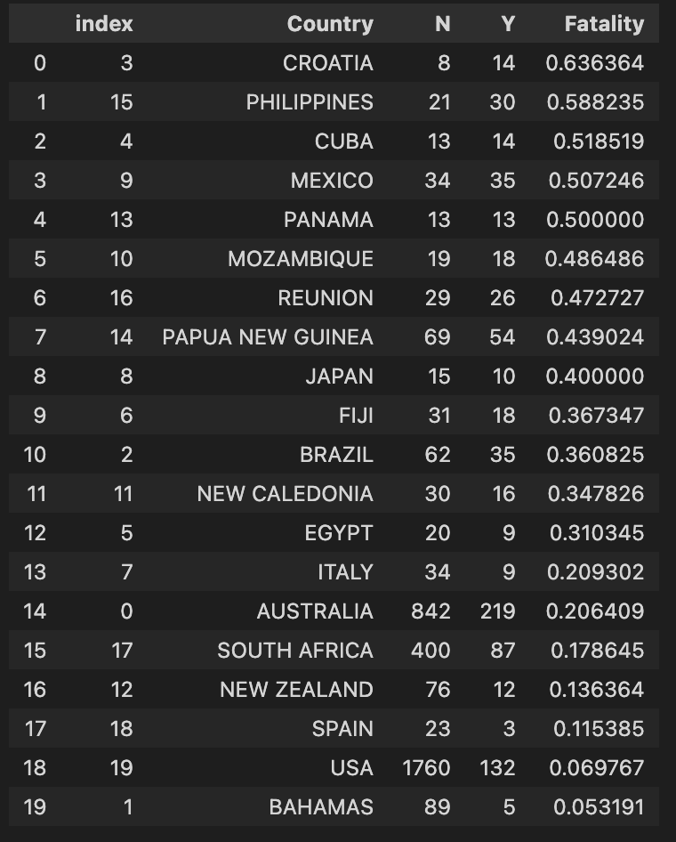
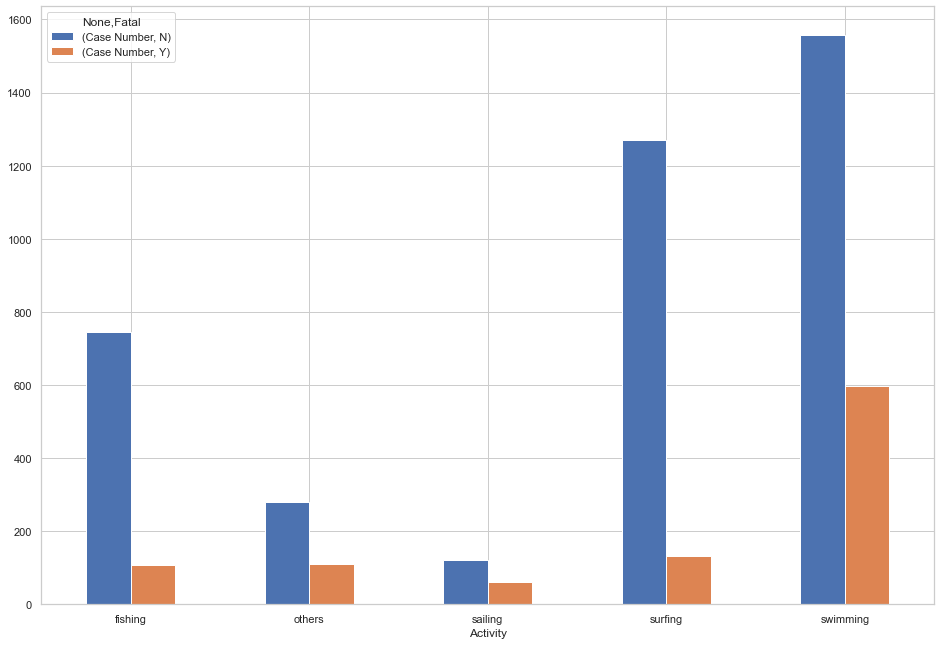
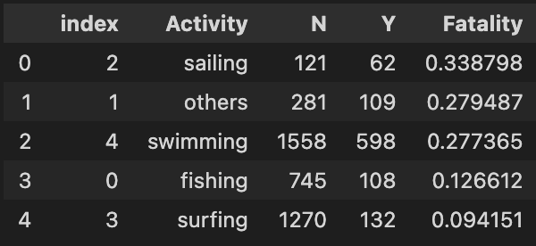
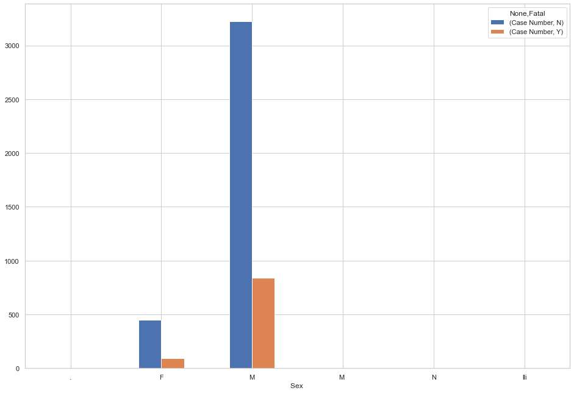
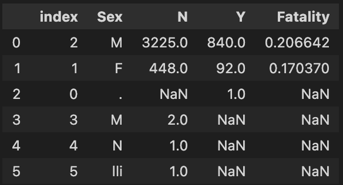

# Data Cleaning in Pandas
## W2 Project

### Andrés Castro

For this project I will analyze data from reported shark attacks arround the world for more than 200 years. The data was recovered in a CSV file from kaggle.com and cleaned using pandas in python. For the analysis I used Seaborn and Matplot Lib.

The cleaning of the data went through each column and applied several process to get to a file that had the most complete, accurate data possible. However, many things couldve done better.

The research questions addressed were the following:
## 1. USA is the most fatal country, only because it is the one with most data
## 2. Swimming is the deadliest activity
## 3. More men die of shark attacks than women
## 4. Most people that die in a shark attack are between 35-40 years old

The file originallly had 25.000+ rows but many of which were filled with empty data. After getting rid of mostly empty rows we had a file of around 6.300 rows. Some columns were redundant or added little to no value so they were deleted as well.

Once I started to tackle the research questions I began to see that the cleaning of the data couldve done better. However, we did get some answers:

### 1. USA is the most fatal country, only because it is the one with most data

### 2. Swimming is the deadliest activity

### 3. More men die of shark attacks than women

